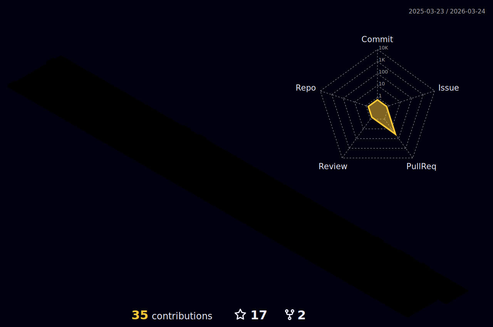

  
  

  

## About 

  Hi 👋, I am Atanas Vihrogonov a front-end developer, my main focus is React + Typescript.
  
  
  
  
  
  

## Skills

  

    <strong>Web Tecnologies:</strong>
    
     
     
    
    
  

  

    <strong>Frameworks:</strong>
    
    
    
     
    
    
  

  

    <strong>Database:</strong>
    
    
  

  

    <strong>Testing:</strong>
    
    
    
  

  

    <strong>Versioning and other tools:</strong>
    
     
    
  

  
Deployment Tools:</strong>
    
    
     
  

  

    <strong>Linting:</strong>
    
    
    
  

  
 

  
<h3>:gear: &nbsp;Git Statistics</h3>

  
  
 
  

    
    
  

 </details
